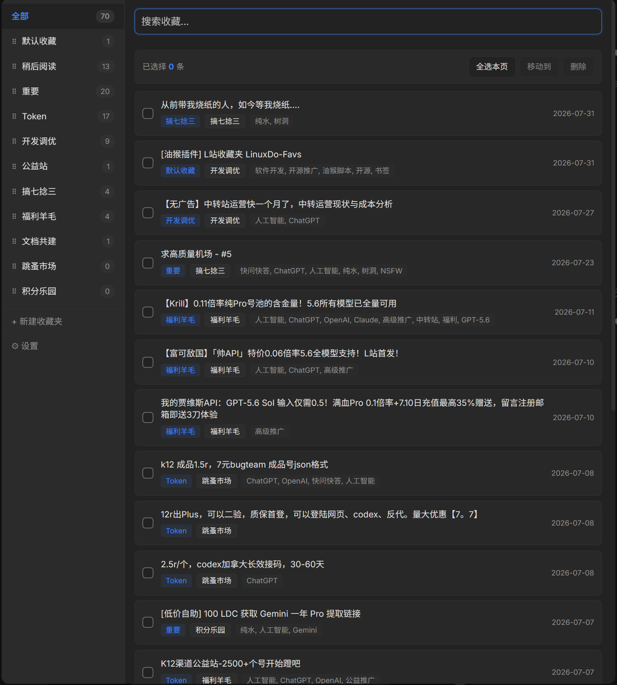
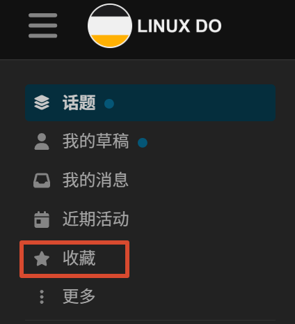
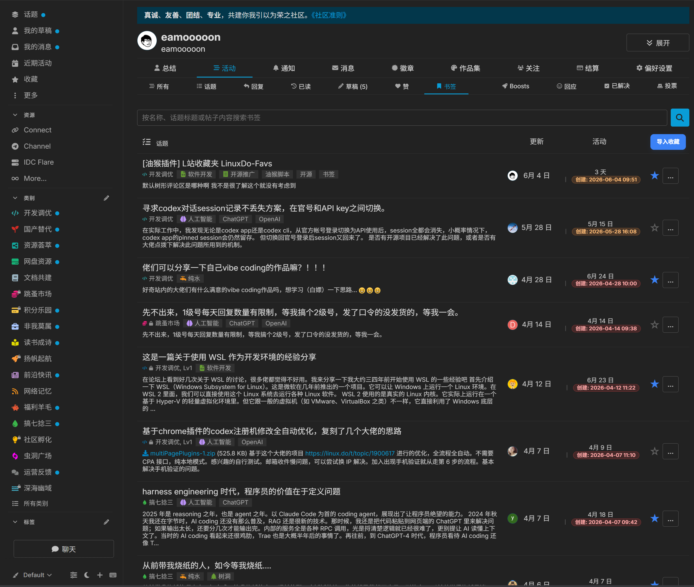
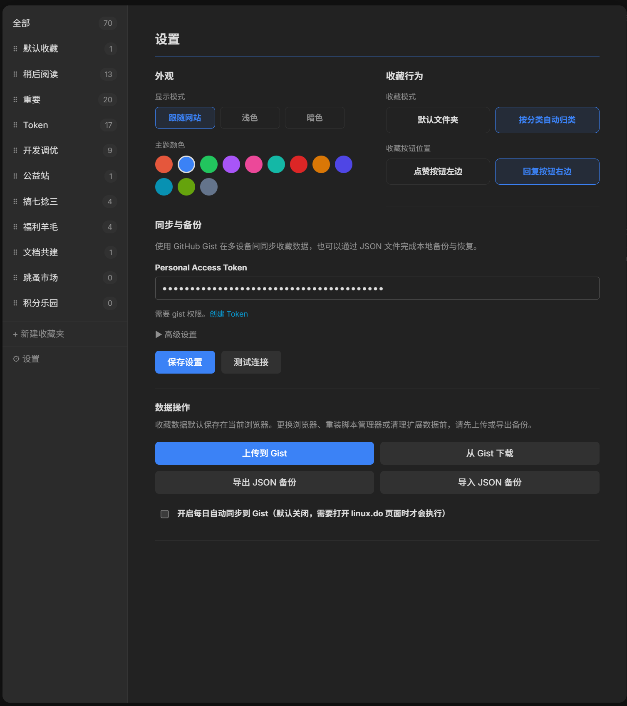

# LinuxDo 收藏夹

为 [linux.do](https://linux.do) 制作的油猴脚本，提供自定义收藏夹管理功能，支持多文件夹分类、主题切换和跨设备同步。

## 更新记录

### 2026-07-31（1.0.8）

- 收藏面板支持分页浏览，不再限制只能显示前 50 条收藏；可选择每页 20、50 或 100 条，并记住用户最后选择的每页数量
- 优化分页底栏，显示当前范围、收藏总数、页码、上一页/下一页和每页数量选择
- 优化收藏面板宽度、搜索框、浅色模式灰色背景、主题色悬停和焦点效果
- 增加跟随网站、浅色、暗色显示模式，并重新整理设置页布局
- 扩充主题颜色选项，主题色会同步应用到按钮、悬停、焦点、选中状态和收藏浮窗
- 优化帖子页和书签页的收藏图标状态，改善收藏按钮响应速度、自动收藏判定和已收藏内容的文件夹浮窗触发速度
- 修复收藏浮窗展开和收起动画缺失的问题
- 优化收藏数据同步与备份设置，支持 Gist 同步和 JSON 导入/导出
- 收藏面板增加批量管理：可直接勾选多条收藏、全选当前页、批量移动到其他文件夹或批量删除
- 选择框改为主题色样式，移除条目右侧重复的单条取消收藏按钮，删除操作统一通过批量工具栏完成
- 修复浅色模式下搜索框、收藏夹名称输入框及设置页输入框仍显示深色的问题
- 优化书签页“导入收藏”按钮和收藏夹选择器，使用与分页选择器一致的主题样式
- 修复导入弹窗默认滚到底部、出现内部滚动条及下拉选项被弹窗遮挡的问题

## 安装

1. 安装 [Tampermonkey](https://www.tampermonkey.net/), [ScriptCat](https://scriptcat.org) 等用户脚本管理器扩展
2. 任选一种方式安装脚本：
   - **一键安装（推荐）**：打开 [ScriptCat 脚本页：LinuxDo 收藏夹](https://scriptcat.org/zh-CN/script-show-page/6125)，点击「安装脚本」按提示完成安装
   - **手动安装**：在管理器中新建脚本，将仓库内 `linux-do-favorites.user.js` 的内容粘贴保存
3. 访问 [linux.do](https://linux.do) 即可使用

## 功能

### 收藏管理





- **帖子/回复收藏**：在帖子页面，每层楼的楼层号旁有收藏按钮（☆/★），点击即可收藏该回复
- **多文件夹分类**：收藏时可选择目标文件夹，支持创建、重命名、删除文件夹和拖拽排序
- **侧边栏入口**：在 LinuxDo 侧边栏添加「收藏」快捷入口，点击「收藏」打开管理面板
- **收藏面板**：全屏管理面板，左侧为文件夹列表，右侧为收藏内容
- **分页浏览**：支持切换每页 20、50 或 100 条，通过页码浏览全部收藏
- **批量管理**：可勾选多条收藏，全选当前页后批量移动到其他文件夹或删除
- **搜索功能**：可按标题、分类、标签搜索收藏内容
- **拖拽移动**：可将收藏项拖到左侧文件夹快速改分类
- **自动归类模式**：在设置中开启「按分类自动归类」后，收藏时会自动匹配与帖子分类同名的文件夹

### 书签页快捷收藏



- 在书签页面每个书签旁显示收藏按钮

### 文件夹选择浮窗

- 点击收藏按钮后弹出文件夹选择浮窗
- 支持在浮窗中直接新建收藏夹
- 重复名称时输入框变红并显示「收藏夹已存在」提示
- 鼠标移开浮窗后自动收藏到默认文件夹

### 设置



在同一设置页可配置显示模式、主题颜色、收藏行为与同步选项。

- 支持跟随网站、浅色和暗色三种显示模式
- 使用 GitHub Gist 在多设备间同步收藏数据
- 填入 Personal Access Token（需 gist 权限）即可使用
- 支持上传/下载数据，自动查找或创建同步用的 Gist
- 设置中可手动指定 Gist ID

## 文件说明

```
linux-do-favorites.user.js    # 油猴脚本主文件
README.md                     # 本文件
docs/images/                  # 文档配图
```

## 友情链接：
[LINUX DO](https://linux.do/)

## 数据安全

- 收藏数据默认保存在当前浏览器的用户脚本管理器本地存储中，不会上传到作者服务器。
- 换浏览器、重装脚本管理器、清理扩展数据前，请先在设置页导出 JSON 备份，或手动上传到 GitHub Gist。
- 设置页支持导入/导出 JSON 备份文件，备份数据包含 `schemaVersion`，便于后续版本迁移。
- 可选择开启每日自动同步到 Gist。该功能默认关闭，开启后会在打开 linux.do 页面时检查距离上次同步是否超过 24 小时，超过则自动上传一次。
